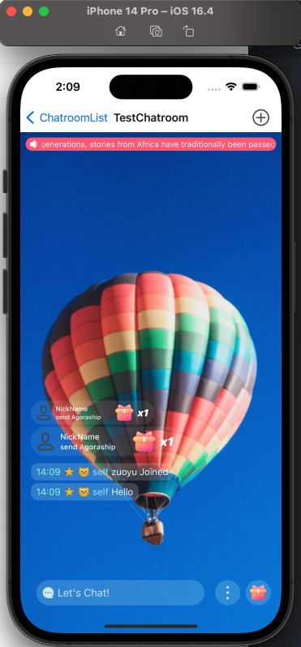
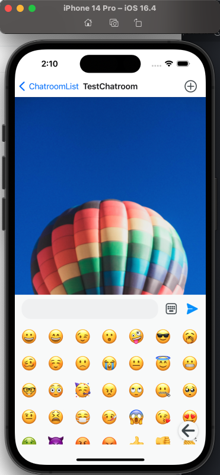
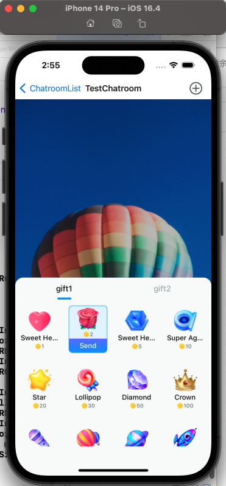

[Return to Parent Document](./index.md)

- [Chatroom UIKit SDK Introduction](#chatroom-uikit-sdk-introduction)
  - [Minimum Requirements](#minimum-requirements)
  - [Project Structure](#project-structure)
  - [Naming Conventions](#naming-conventions)
  - [Component Overview](#component-overview)
  - [Component List](#component-list)
    - [Theme Introduction](#theme-introduction)
    - [Internationalization Introduction](#internationalization-introduction)
    - [Initialization Introduction](#initialization-introduction)
    - [Chatroom Component](#chatroom-component)
    - [MessageList Component](#messagelist-component)
    - [ParticipantList Component](#participantlist-component)
    - [GiftMessageList Component](#giftmessagelist-component)
    - [GlobalBroadcast Component](#globalbroadcast-component)
    - [MessageInput Component](#messageinput-component)
    - [BottomToolbar Component](#bottomtoolbar-component)
    - [BottomSheetGift Component](#bottomsheetgift-component)
    - [ReportMessage Component](#reportmessage-component)
  - [Component Customization](#component-customization)
    - [Customizing the GiftMessageList Component](#customizing-the-giftmessagelist-component)
    - [Customizing the GlobalBroadcast Component](#customizing-the-globalbroadcast-component)
    - [Customizing the Message List Item Style](#customizing-the-message-list-item-style)
    - [Customizing the Chatroom Member List Item Style](#customizing-the-chatroom-member-list-item-style)

# Chatroom UIKit SDK Introduction

This project is the `Chatroom UIKit SDK`, referred to as `UIKit`. It provides a collection of UI components for chatrooms based on the `Chat SDK`. It helps users to quickly set up chatroom applications.

## Minimum Requirements

Requirements for using this project:

- MacOS 12 or later
- React-Native 0.66 or later
- NodeJs 16.18 or later

For `iOS` applications:

- Xcode 13 or later, and its related dependency tools.

For `Android` applications:

- Android Studio 2021 or later, and its related dependency tools.

## Project Structure

The main structure of the project is as follows:

```sh
.
├── biz // Contains business UI components, such as primary chatroom components, secondary member list components, etc.
├── config // Global configuration service, e.g., whether to activate `UIKit` logs.
├── container // UIKit entry component
├── dispatch // Event dispatch service, for sending and receiving notifications between closely related components.
├── error // Error objects, providing unified error codes.
├── hook // Function component utilities, cannot be used by Class components.
├── i18n // Internationalization service
├── room // Chat SDK service, provides more convenient usage and unified error handling.
├── theme // Theme service, provides light and dark themes, with customizable basic colors.
├── ui // Basic UI components, supporting other advanced components, with theme support.
└── utils // Utility collection
```


## Naming Conventions

Components are categorized in multiple ways. According to React-Native usage conventions, here are the main naming conventions:

- index.tsx: The export file for objects.
- types.tsx: The export file for type declarations.
- const.tsx: Constant file, usually not exposed.
- Context: A context object for data sharing. Services such as theme and internationalization are provided this way.
- Provider: A provider object for data sharing.
- Consumer: A consumer object for data sharing.
- Container: The entry component of `UIKit`, integrates all other internal services and components, which must be initialized first by users.
- use- prefix: Hook utilities used by Function components, not available for Class components. This `UIKit` primarily uses Function components.
- Suffix Props: The parameter type for UI components.
- Suffix Memo: The type for UI components that use memoization.
- Suffix Ref: A reference for UI components that can control their behavior (e.g., focus, modal windows).
- Suffix Model: Data type for parameters in UI components.
- Suffix Service: Non-UI components that provide specific services (e.g., RoomService).

## Component Overview

The `Chatroom UIKit SDK` components are broadly divided into UI components and non-UI components. UI components primarily display content, while non-UI components focus on specific functionality.

From the user's perspective, components can be divided into directly used components and indirectly used components. For example, the `Chatroom` component is a directly used component, while the `ParticipantList` component is indirectly used. From the perspective of component construction, components can be divided into top-level components, business components, and base components. For example, the `Chatroom` component is a top-level component, the `MessageList` is a business component, and `SlideModal` is a base component.

Components can also be classified based on their size as page-level components and non-page-level components. Page-level components occupy the full screen, such as the `Chatroom` component. Other components are non-page-level components, and `Modal` components are a special category where they cannot coexist with other similar components.

Some components have specific constraints, such as `ScrollView`, which requires a defined height or a parent with a defined height.


| Basic Common UI Components | Function/Class   | Basic | Page-Level | Popup | Location | Size | Style | Control | Customizable | Description                                                                                   |
| -------------------------- | ---------------- | ----- | ---------- | ----- | -------- | ---- | ----- | ------- | ------------ | --------------------------------------------------------------------------------------------- |
| Text                       | Function         | ✅    | ❌         | ❌    | ✅       | ✅   | ✅    | ❌      | ✅           | Basic text component: close to native, supports theme.                                        |
| TextInput                  | Function         | ✅    | ❌         | ❌    | ✅       | ✅   | ✅    | ✅      | ✅           | Basic text input component: native Android doesn't meet design requirements.                  |
| TabPage                    | Function         | ✅    | ❌         | ❌    | ✅       | ✅   | ✅    | ❌      | ❌           | Tab page component: native doesn't support, new feature supports lazy loading.                |
| Modal                      | Function         | ✅    | ❌         | ✅    | ✅       | ✅   | ✅    | ✅      | ✅           | Modal component: native doesn't meet design requirements, added non-modal similar components. |
| Image                      | Function & Class | ✅    | ❌         | ❌    | ✅       | ✅   | ✅    | ❌      | ✅           | Image component: close to native, custom error handling.                                      |
| Button                     | Function         | ✅    | ❌         | ❌    | ✅       | ✅   | ✅    | ❌      | ❌           | Button component: close to Pressable, supports theme.                                         |
| FlatList                   | Function         | ✅    | ❌         | ❌    | ✅       | ✅   | ✅    | ✅      | ✅           | Native doesn't support error and loading pages.                                               |

## Component List

The `room uikit sdk` mainly includes the following components:

| Component Name  | Description                                                                                                 | Link                                                       |
| --------------- | ----------------------------------------------------------------------------------------------------------- | ---------------------------------------------------------- |
| Theme           | Can set the color and style of all `UIKit` components and switch between `light` and `dark` themes.         | [Theme Introduction](#Theme)                               |
| I18n            | Can set the language for all UI components of `UIKit`.                                                      | [Internationalization Introduction](#Internationalization) |
| Chatroom        | Chatroom component, integrates components like gift sending, message list, member list, and gift reception. | [Chatroom](#Chatroom)                                      |
| MessageList     | Chatroom message list component for displaying sent or received messages.                                   | [MessageList](#MessageList)                                |
| ParticipantList | Chatroom member list component, including member and muted member management.                               | [ParticipantList](#ParticipantList)                        |
| GiftMessageList | Gift message list component for displaying reward gifts.                                                    | [GiftMessageList](#GiftMessageList)                        |
| GlobalBroadcast | Global broadcast component for all chatrooms.                                                               | [GlobalBroadcast](#GlobalBroadcast)                        |
| MessageInput    | Message input component for sending various messages.                                                       | [MessageInput](#MessageInput)                              |
| BottomToolbar   | Bottom function area component that can switch the message input component or add custom buttons.           | [BottomToolbar](#BottomToolbar)                            |
| BottomSheetGift | Gift sending component where gifts can be sent, the source of gifts is defined by the developer.            | [BottomSheetGift](#BottomSheetGift)                        |
| ReportMessage   | Message reporting component.                                                                                | [BottomSheetGift](#BottomSheetGift)                        |

### Theme Introduction

Each UI component uses a theme. The theme service provides `light` and `dark` themes and supports one-click switching.

A simple example is as follows:

```tsx
// ...
// Define the theme setting state
const palette = usePresetPalette();
const dark = useDarkTheme(palette);
const light = useLightTheme(palette);
const [theme, setTheme] = React.useState(light);
// ...
// Add the component to the render tree
<Container appKey={env.appKey} palette={palette} theme={theme} />;
// ...
// Change the theme setting
setTheme(theme === light ? dark : light);
```

Customize theme colors. `usePresetPalette` uses built-in default theme colors, or `useCreatePalette` can set custom theme colors.

```tsx
// Custom colors. By modifying the specific values of the colors, the corresponding colors in the components will be unified.
const { createPalette } = useCreatePalette({
  colors: {
    primary: 203,
    secondary: 155,
    error: 350,
    neutral: 203,
    neutralSpecial: 220,
  },
});
const palette = createPalette();
// ...
```

### Internationalization Introduction

UIKit supports switching between multiple languages, currently built-in with Chinese and English, and can extend other languages.

For example, to make UIKit display in English:

```tsx
<Container appKey={env.appKey} language={'en'} />
```

Language setting rules:

- If no language is set, the default system language is used.
- If the system language is neither Chinese nor English, Chinese is selected for domestic use and English for overseas use.
- If the set language is neither Chinese nor English, and no corresponding language set is provided, Chinese is selected for domestic use and English for overseas use.

For example, if the application developer needs to set Chinese as the language and wish the app itself to use it:

```tsx
// ...
// Create the required language pack for the app
function createLanguage(type: LanguageCode): StringSet {
  return {
    'Chinese text.': '中文文本.',
  };
}
// ...
// Set the specified language set and provide the language translation source
<Container
  appKey={env.appKey}
  language={'zh-Hans'}
  languageExtensionFactory={createLanguage}
/>;
// ...
// In the internationalization needed places
const { tr } = useI18nContext();
return <Text>{tr('Chinese text.')}</Text>;
```

For example, if the application developer wants to set French and have both the app and UIKit display in French:

```tsx
// ...
// Create the application extension language set
function createAppLanguage(type: LanguageCode): StringSet {
  if (type === 'fr') {
    return {
      'French text.': 'Texte français.',
    };
  }
  return {
    'French text.': 'French text.',
  };
}
// Create UIKit's language set by modifying `StringSet.en.tsx` to change all `value` to French.
export function createUIKitLanguage(type: LanguageCode): StringSet {
  if (type === 'fr') {
    return {
      'Private Chat': 'Chat privé',
      '...': '...',
    };
  }
}
// ...
<Container
  appKey={env.appKey}
  language={'fr'}
  languageBuiltInFactory={createUIKitLanguage}
  languageExtensionFactory={createAppLanguage}
/>;
```

### Initialization Introduction

The entry of the `Chatroom UIKit SDK` is the `Container` component, which is mainly responsible for integrating other components and parameter configuration.

```tsx
export type ContainerProps = React.PropsWithChildren<{
  appKey: string;
  isDevMode?: boolean;
  language?: StringSetType;
  languageBuiltInFactory?: CreateStringSet;
  languageExtensionFactory?: CreateStringSet;
  palette?: Palette;
  theme?: Theme;
  roomOption?: PartialRoomOption;
  avatar?: {
    borderRadiusStyle?: CornerRadiusPaletteType;
  };
  fontFamily?: string;
  onInitialized?: () => void;
}>;
```

```tsx
// Mainly controls whether components in the chatroom component are loaded.
export type RoomOption = {
  globalBroadcast: {
    isVisible: boolean;
  };
  gift: {
    isVisible: boolean;
  };
  messageList: {
    isVisibleGift: boolean;
    isVisibleTime: boolean;
    isVisibleTag: boolean;
    isVisibleAvatar: boolean;
  };
};
```

Except for `appKey`, all other parameters are optional.

- isDevMode: If set to `true`, activates log printing and other tools.
- language: Sets the current language. If not set, the system's default language will be used.
- languageBuiltInFactory: If not set, the built-in language resources will be used. Typically used for modifying built-in UI content.
- languageExtensionFactory: If set, will extend the language resources. Usually, the app's UI also needs internationalization.
- palette: Sets the current color palette, a key dependency for theme services.
- theme: If not set, the `light` theme will be used by default.
- roomOption: Chatroom options. Refer to the global configuration service.
- avatar: Sets the global avatar corner radius style.
- fontFamily: Supports custom fonts. By default, the system font is used.
- onInitialized: Callback notification after initialization is complete.

Global configuration parameters:

- globalBroadcast: Global broadcast component configuration, whether to load.
- gift: Gift message list component configuration, whether to load.
- messageList: Message list component configuration
  - isVisibleGift: Whether to load the gift message component.
  - isVisibleTime: Whether to show time labels.
  - isVisibleTag: Whether to show tag labels.
  - isVisibleAvatar: Whether to show avatar labels.

The `Container` is usually at the bottom of the application, generally as the root component or at the same level as the root component. For example:

```tsx
export function App() {
  return <Container appKey={'your app key'}>{children}</Container>;
}
```

### Chatroom Component

The chatroom component is a collection of components such as member list, input component, message list, reward message, global broadcast notification, menu, etc. It is a page-level component and occupies most of the screen. If you want to add components, it is recommended to make them its child components or background components.

A simple example is as follows:

```tsx
// ...
// Create reference object
const ref = React.useRef<Chatroom>({} as any);
// ...
// Add the component to the render tree
<Chatroom ref={chatroomRef} roomId={room.roomId} ownerId={room.owner} />;
```

Since `UIKit` doesn't have routing (because `React-Native` doesn't have built-in routing), to perform member search, you need to set it like this:

```tsx
<Chatroom
  ref={chatroomRef}
  participantList={{
    props: {
      onSearch: (memberType) => {
        // todo: Click the search button to jump to the search page
        navigation.push('SearchParticipant', { params: { memberType } });
      },
    },
  }}
  roomId={room.roomId}
  ownerId={room.owner}
/>
```

`Chatroom` Properties Overview:

| Property                   | Optional | Description                                                                           |
| -------------------------- | -------- | ------------------------------------------------------------------------------------- |
| containerStyle             | Optional | Sets the component container style. Supports background, position, size, border, etc. |
| GiftMessageList            | Optional | Renderer for the gift message component.                                              |
| GlobalBroadcast            | Optional | Renderer for the global broadcast component.                                          |
| MessageList                | Optional | Renderer for the message list component.                                              |
| MessageInput               | Optional | Renderer for the input component.                                                     |
| BottomSheetParticipantList | Optional | Renderer for the member list component.                                               |
| input                      | Optional | Attributes for the input component.                                                   |
| messageList                | Optional | Attributes for the message list component.                                            |
| globalBroadcast            | Optional | Global broadcast settings for the chatroom.                                           |
| gift                       | Optional | Gift message settings.                                                                |
| participantList            | Optional | Settings for the member list component.                                               |
| backgroundView             | Optional | Background component settings.                                                        |

`Chatroom` Methods Overview:

| Method                | Description                                                   |
| --------------------- | ------------------------------------------------------------- |
| getGlobalBroadcastRef | Get reference for the `GlobalBroadcast` component.            |
| getGiftMessageListRef | Get reference for the `GiftMessageList` component.            |
| getParticipantListRef | Get reference for the `BottomSheetParticipantList` component. |
| getMessageListRef     | Get reference for the `MessageList` component.                |
| joinRoom              | Join a chatroom                                               |
| leaveRoom             | Leave a chatroom                                              |



### MessageList Component

The chatroom message area component `MessageList` displays messages, including text messages, emoji messages, gift messages, and messages that have been successfully sent.

The message list allows operations on messages. For example, you can translate text messages into target languages, revoke messages, or report messages. You can also open a context menu by long-pressing a message list item for further operations.

The reporting component supports custom options, allowing different content to be reported.

A simple usage example:

```tsx
// ...
// Create a reference object for the component
const ref = React.useRef<MessageListRef>({} as any);
// Add the message list component to the render tree
<MessageList ref={ref} />;
// ...
// Add a message to the list, it will display in the list
ref?.current?.addSendedMessage?.(message);
```

`MessageList` Properties Overview:

| Property                 | Optional | Description                                                          |
| ------------------------ | -------- | -------------------------------------------------------------------- |
| visible                  | Optional | Controls whether the component is visible                            |
| onUnreadCount            | Optional | Callback when the unread count changes                               |
| onLongPressItem          | Optional | Callback for long pressing an item in the message list               |
| containerStyle           | Optional | Sets the container style (background, position, size, etc.)          |
| onLayout                 | Optional | Callback when the component layout changes                           |
| MessageListItemComponent | Optional | The renderer for each message list item                              |
| reportProps              | Optional | Properties for message reporting                                     |
| maxMessageCount          | Optional | The maximum number of messages that can be displayed (default: 1000) |
| messageMenuItems         | Optional | Custom message menu items, added to the default menu                 |

`MessageList` Methods Overview:

| Method           | Description                                       |
| ---------------- | ------------------------------------------------- |
| addSendedMessage | Adds a message from the input to the message list |
| scrollToEnd      | Scrolls the message list to the bottom            |


### ParticipantList Component

The chatroom member component displays and manages chatroom members. The room owner has permissions to manage both regular members and the muted list.

Room owners can change member status. For example, they can mute a member or remove a member from the chatroom.

**Note**: The member list display is not implemented in `UIKit`. Therefore, application developers need to implement it themselves. For instance, you can add a button that triggers the display of the member list component.

The `BottomSheetParticipantList` component is a combination of `SimulativeModal` and `ParticipantList`, making it an independent component that can be shown and hidden.

Simple usage example:

```tsx
// ...
// Create a reference object for the component
const ref = React.useRef<BottomSheetParticipantListRef>({} as any);
// Add the member list component to the render tree
<BottomSheetParticipantList ref={this.ref} />;
// ...
// Show the member list component by triggering a specific action, such as a button click.
ref?.current?.startShow?.();
```

`BottomSheetParticipantList` Properties Overview:

| Property            | Optional | Description                                                           |
| ------------------- | -------- | --------------------------------------------------------------------- |
| onSearch            | Optional | Callback when the search button is pressed                            |
| onNoMoreMember      | Optional | Callback when there are no more members to load                       |
| containerStyle      | Optional | Sets the component container style (background, position, size, etc.) |
| maskStyle           | Optional | Sets the style for the area outside the component container           |
| MemberItemComponent | Optional | The renderer for each member item                                     |

`BottomSheetParticipantList` Methods Overview:

| Method                | Description                                                 |
| --------------------- | ----------------------------------------------------------- |
| startShow             | Displays the component                                      |
| startHide             | Hides the component, notifying once the animation completes |
| getParticipantListRef | Retrieves the reference to the component                    |

`ParticipantList` Methods Overview:

| Method       | Description                                                           |
| ------------ | --------------------------------------------------------------------- |
| initMenu     | Initializes the custom member list menu, appended to the default menu |
| removeMember | Removes a member from the list                                        |
| muteMember   | Mutes or unmutes a member                                             |
| closeMenu    | Closes the menu                                                       |


### GiftMessageList Component

The reward message component is used to display gift effects, and gift messages can appear in either the message list or this component.

Simple usage example:

```tsx
// ...
// Create a reference object for the component
const ref = React.useRef<GiftMessageListRef>({} as any);
// Add the component to the render tree
<GiftMessageList ref={ref} />;
// ...
// Add a gift message to the message queue, which will be displayed in sequence.
ref.current?.pushTask({
  model: {
    id: seqId('_gf').toString(),
    nickName: 'NickName',
    giftCount: 1,
    giftIcon: 'http://notext.png',
    content: 'send Agoraship too too too long',
  },
});
```

`GiftMessageList` Properties Overview:

| Property                | Optional | Description                               |
| ----------------------- | -------- | ----------------------------------------- |
| visible                 | Optional | Controls whether the component is visible |
| containerStyle          | Optional | Sets the component container style        |
| GiftEffectItemComponent | Optional | The renderer for each gift effect item    |

`GiftMessageList` Methods Overview:

| Method   | Description                                       |
| -------- | ------------------------------------------------- |
| pushTask | Adds a gift message task to the queue for display |

### GlobalBroadcast Component

The global broadcast notification component receives and displays global broadcasts for all chatrooms. Messages are added to the queue for sequential display.

Simple usage example:

```tsx
// ...
// Create a reference object for the component
const ref = React.useRef<GlobalBroadcastRef>({} as any);
// ...
// Add the component to the render tree
<GlobalBroadcast ref={ref} />;
// ...
// Add a message to the task queue for display.
let count = 1;
ref.current?.pushTask?.({
  model: {
    id: count.toString(),
    content: count.toString() + content,
  },
});
```

`GlobalBroadcast` Properties Overview:

| Property                | Optional | Description                                          |
| ----------------------- | -------- | ---------------------------------------------------- |
| visible                 | Optional | Controls whether the component is visible            |
| playSpeed               | Optional | The speed at which the message scrolls, default is 8 |
| containerStyle          | Optional | Sets the component container style                   |
| textStyle               | Optional | Sets the text style of the component                 |
| icon                    | Optional | Sets the icon style for the component                |
| GiftEffectItemComponent | Optional | The renderer for each gift effect item               |
| onFinished              | Optional | Callback when all messages have finished displaying  |
| onLayout                | Optional | Callback when the component layout changes           |

`GlobalBroadcast` Methods Overview:

| Method   | Description                                        |
| -------- | -------------------------------------------------- |
| pushTask | Adds a message to the queue for sequential display |

### MessageInput Component

The message input component can send text and emoji messages. It works together with the input style component for dynamic switching. When the input box style component is clicked, it switches to input mode, and when a message is sent or the input box is closed, it switches back to the input box style.

Simple usage example:

```tsx
// ...
// Create a reference object for the component
const ref = React.useRef<MessageInputRef>({} as any);
// ...
// Add the component to the render tree
<MessageInput
  ref={ref}
  onSended={(_content, message) => {
    // todo: Call the message list reference to add the message to the list
  }}
/>;
// ...
// Close the input state
ref?.current?.close?.();
```

`MessageInput` Properties Overview:

| Property               | Optional | Description                                                    |
| ---------------------- | -------- | -------------------------------------------------------------- |
| onInputBarWillShow     | Optional | Callback when it is about to switch to input state             |
| onInputBarWillHide     | Optional | Callback when it is about to switch to input box style         |
| onSended               | Optional | Callback after the message is sent                             |
| keyboardVerticalOffset | Optional | Keyboard offset value                                          |
| closeAfterSend         | Optional | Whether to switch to input box style after sending the message |
| first                  | Optional | First custom component in the input box style                  |
| after                  | Optional | The list of custom components after the first one (maximum 3)  |
| onLayout               | Optional | Callback when the layout of the input style component changes  |

`MessageInput` Methods Overview:

| Method | Description                                            |
| ------ | ------------------------------------------------------ |
| close  | Closes the input state and switches to the input style |




### BottomToolbar Component

The input style component. Together with the input box component, they form a composite component that can dynamically switch.

### BottomSheetGift Component

The gift list component provides a custom gift list. Clicking the send button on a gift item sends it to the chatroom.

**Note**: The gift list component is independent and requires application developers to implement display, loading, and other operations.

Simple usage example:

```tsx
// ...
// Create a reference object for the component
const ref = React.useRef<BottomSheetGiftSimuRef>({} as any);
// ...
// Add the component to the render tree
<BottomSheetGift
  ref={ref}
  gifts={[
    {
      title: 'gift1',
      gifts: [
        {
          giftId: '2665752a-e273-427c-ac5a-4b2a9c82b255',
          giftIcon:
            'https://fullapp.oss-cn-beijing.aliyuncs.com/uikit/pictures/gift/AUIKitGift1.png',
          giftName: 'Sweet Heart',
          giftPrice: 1,
        },
      ],
    },
  ]}
  onSend={(giftId) => {
    // todo: Send the selected gift.
  }}
/>;
// ...
// Show the gift list component
ref?.current?.startShow?.();
```

**Note**: The gift sending component provides `BottomSheetGift` and `BottomSheetGift2`, with the main difference being whether it's a modal or non-modal component.

`BottomSheetGift` Properties Overview:

| Property  | Optional | Description                                                 |
| --------- | -------- | ----------------------------------------------------------- |
| gifts     | Optional | Array of gift items                                         |
| maskStyle | Optional | Sets the style for the area outside the component container |
| onSend    | Optional | Callback when the send button is clicked                    |

`BottomSheetGift` Methods Overview:

| Method            | Description                                                     |
| ----------------- | --------------------------------------------------------------- |
| startShow         | Displays the component                                          |
| startShowWithInit | Displays the component and initializes the list                 |
| startHide         | Hides the component and notifies when the animation is complete |



### ReportMessage Component

The message report component allows you to report messages.

Simple usage example:

```tsx
// ...
// Create a reference object for the component
const ref = React.useRef<BottomSheetMessageReport>({} as any);
// ...
// Add the component to the render tree
<BottomSheetMessageReport
  ref={ref}
  onReport={getOnReport.onReport}
  data={getReportData}
/>;
// ...
// Show the component
ref?.current?.startShow?.();
// ...
// Select a list item and confirm the report.
```

`BottomSheetMessageReport` Properties Overview:

| Property       | Optional | Description                                                 |
| -------------- | -------- | ----------------------------------------------------------- |
| data           | Optional | Array of report data                                        |
| maskStyle      | Optional | Sets the style for the area outside the component container |
| containerStyle | Optional | Sets the style for the component container                  |
| onReport       | Optional | Callback when the report button is clicked                  |

`BottomSheetMessageReport` Methods Overview:

| Method    | Description                                                     |
| --------- | --------------------------------------------------------------- |
| startShow | Displays the component                                          |
| startHide | Hides the component and notifies when the animation is complete |

## Component Customization

### Customizing the GiftMessageList Component

The `Chatroom` component consists of other components, which may not meet the specific needs, in which case you can replace them. For example, you can replace the `GiftMessageList` component. As long as it meets the constraint of `GiftMessageListComponent`, the replaced component can implement custom business logic or styles.

For example:

```tsx
export const MyGiftMessageList: GiftMessageListComponent = React.forwardRef<
  GiftMessageListRef,
  GiftMessageListProps
>(function (
  props: GiftMessageListProps,
  ref?: React.ForwardedRef<GiftMessageListRef>
) {
  // todo: Implement your own business logic, or modify existing business logic.
  const {} = props;
  React.useImperativeHandle(
    ref,
    () => {
      return {
        pushTask: (task: GiftMessageListTask) => {
          // todo: Implement this interface.
        },
      };
    },
    []
  );
  return <></>;
});
```

Replace the default `GiftMessageList` component:

```tsx
<Chatroom GiftMessageList={MyGiftMessageList} />
```

### Customizing the GlobalBroadcast Component

The `GlobalBroadcast` component can also be replaced. As long as it meets the constraint of `GlobalBroadcastComponent`, it can be replaced.

```tsx
export const MyGlobalBroadcast = React.forwardRef<
  GlobalBroadcastRef,
  GlobalBroadcastProps
>(function (
  props: GlobalBroadcastProps,
  ref?: React.ForwardedRef<GlobalBroadcastRef>
) {
  // todo: Implement your own business logic, or modify existing business logic.
  React.useImperativeHandle(
    ref,
    () => {
      return {
        pushTask: (task: GlobalBroadcastTask) => {
          // todo:  Implement this interface.
        },
      };
    },
    []
  );
  return <></>;
});
```

Replace the default `GlobalBroadcast` component:

```tsx
<Chatroom GlobalBroadcast={MyGlobalBroadcast} />
```

### Customizing the Message List Item Style

You can modify the style of the message list item. For example:

```tsx
export function MyMessageListItem(props: MessageListItemProps) {
  // todo: Implement your own business logic, or modify existing business logic.
  return <></>;
}
export const MyMessageListItemMemo = React.memo(MyMessageListItem);
```

Add the modified component to `Chatroom`.

```tsx
<Chatroom
  messageList={{
    props: {
      MessageListItemComponent: MyMessageListItemMemo,
    },
  }}
/>
```

### Customizing the Chatroom Member List Item Style

You can modify the style of the chatroom member list item. For example:

```tsx
export function MyParticipantListItem(props: ParticipantListItemProps) {
  // todo: Implement your own business logic, or modify existing business logic.
  return <></>;
}

export const MyParticipantListItemMemo = React.memo(MyParticipantListItem);
```

Add the modified component to `Chatroom`.

```tsx
<Chatroom
  participantList={{
    props: {
      MemberItemComponent: MyParticipantListItemMemo,
    },
  }}
/>
```
